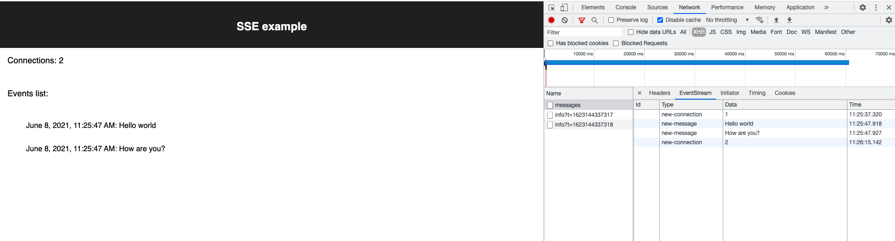

### About
This is the simple app bootstrapped with Razzle to showcase Server Sent Events




### Start
Run 
```
yarn start
```
or
```
npm run start
```

- open localhost:3000

- open multiple tabs, explore `/messages` in network tab 

- send request via terminal:
```
curl --location --request POST 'http://localhost:3000/events/messages' \
--header 'Content-Type: application/json' \
--data-raw '["Hello world", "How are you?"]'
```
